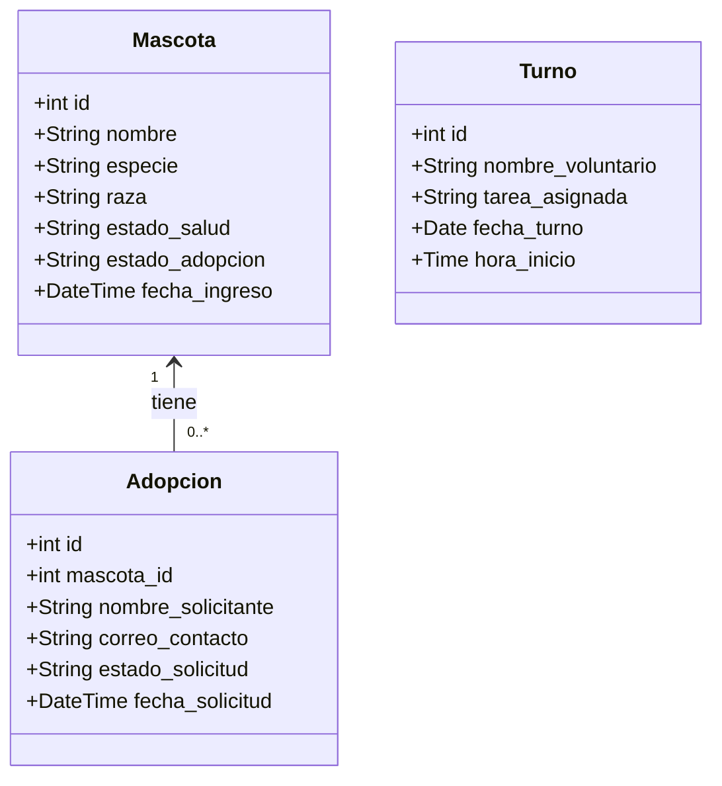

# Sistema de Gestión para Refugio de Mascotas - Avance 1

## Descripción del Proyecto
Este proyecto consiste en el desarrollo de una plataforma web para la gestión de adopciones, expedientes médicos y coordinación de voluntarios en un refugio de animales. El sistema está diseñado bajo una arquitectura Cliente-Servidor, garantizando la separación de responsabilidades.

## Arquitectura y Tecnologías
*   **Arquitectura:** Cliente-Servidor.
*   **Backend:** PHP con PDO para conexiones seguras a la base de datos.
*   **Base de Datos:** MariaDB (MySQL) contenida e integrada en el entorno.
*   **Entorno de Desarrollo:** GitHub Codespaces apoyado en Docker Compose.
*   **Frontend:** Interfaz de usuario planificada en React y TypeScript.

## Diagrama de Clases
El modelo de datos está estructurado en tres entidades independientes para facilitar la división del trabajo y evitar acoplamientos innecesarios.



## Estructura del Backend (API)
El backend se comunica exclusivamente a través de formato JSON y expone los siguientes módulos de interacción:
*   `/api/mascotas.php`: Gestión de expedientes médicos y registros de ingreso (GET, POST).
*   `/api/adopciones.php`: Gestión de solicitudes de adopción (GET, POST).
*   `/api/turnos.php`: Asignación de tareas operativas a voluntarios (GET, POST).

## Instrucciones de Ejecución (GitHub Codespaces)

### 1. Configuración de la Base de Datos
Al abrir el entorno virtual, la base de datos MariaDB se inicializa mediante Docker. Para crear las tablas, ingresar a la terminal del motor de base de datos ignorando la validación SSL local temporalmente:

```bash
mysql -h 127.0.0.1 -u root -pmariadb --skip-ssl
```

Una vez dentro, ejecutar el script SQL de creación de la base de datos `refugio_db` y sus respectivas tablas. Escribir `exit` al finalizar la configuración.

### 2. Ejecutar el Servidor Backend
Para levantar el servidor de desarrollo interno de PHP y exponer los endpoints de la API, ejecutar el siguiente comando en la terminal desde la raíz del proyecto:

```bash
php -S localhost:8000
```

### 3. Pruebas de la API
Con el servidor en ejecución, se puede probar los endpoints desde una nueva pestaña de terminal simulando peticiones HTTP.

Ejemplo para registrar un expediente de mascota:

```bash
curl -X POST http://localhost:8000/api/mascotas.php \
-H "Content-Type: application/json" \
-d '{"nombre": "Manchas", "especie": "Perro", "raza": "Dálmata", "estado_salud": "Vacunado"}'
```

Ejemplo para consultar las mascotas registradas:

```bash
curl http://localhost:8000/api/mascotas.php

```