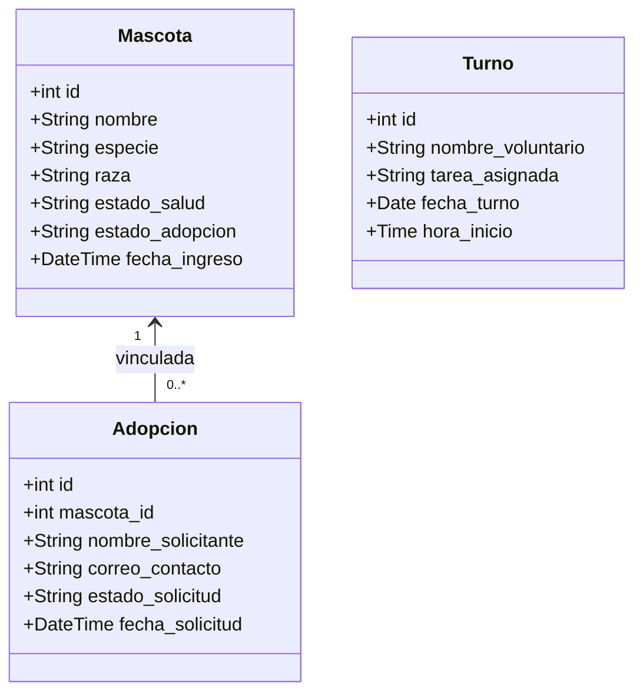
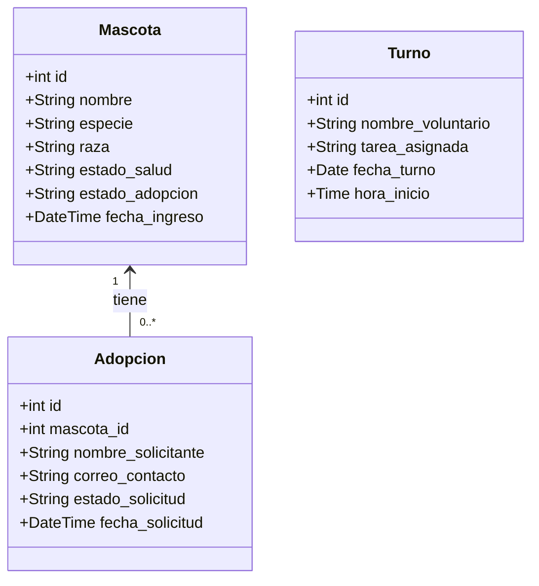

# Sistema de Gestión para Refugio de Mascotas

---

## 🚀 Avance 2

### Descripción del Proyecto
Plataforma web para la gestión integral de adopciones, expedientes clínicos y asignación de turnos operativos en un refugio de animales. El sistema implementa una arquitectura desacoplada con cliente SPA en React 19 + TypeScript y API REST en PHP con persistencia en MariaDB.

### Integrantes del Equipo y Módulos de Trabajo
* **Arianna Feijoo:** Módulo de Mascotas (`api/mascotas.php`, `frontend/src/components/pets/`, `frontend/src/services/petService.ts`, `frontend/src/types/pet.ts`).
* **Matías Collaguazo:** Módulo de Adopciones (`api/adopciones.php`, `frontend/src/components/adoptions/`, `frontend/src/services/adoptionService.ts`, `frontend/src/types/adoption.ts`).
* **Diego Alfonzo:** Módulo de Turnos (`api/turnos.php`, `frontend/src/components/shifts/`, `frontend/src/services/shiftService.ts`, `frontend/src/types/shift.ts`).

### Arquitectura y Principios de Diseño
* **Inversión de Dependencias (DIP):** Contratos de interfaz tipados (`IPetService`, `IAdoptionService`, `IShiftService`) desacoplados del transporte HTTP.
* **Transacciones Atómicas y Bloqueo Concurrente:** El backend PHP implementa sentencias preparadas nativas (`PDO::ATTR_EMULATE_PREPARES => false`) y transacciones con bloqueo pesimista (`SELECT ... FOR UPDATE`) para evitar condiciones de carrera en solicitudes simultáneas.
* **Resiliencia Asíncrona en Frontend:** Cancelación de peticiones mediante `AbortController`, estados explícitos de carga, error y vacío, sin sincronizaciones redundantes de estado.
* **Accesibilidad (a11y):** Estándares WCAG aplicados en modales accesibles con `role="dialog"`, atributos `aria-*`, navegación por teclado y formularios vinculados semánticamente con `useId()`.
* **Prototipo UI:** [Figma Prototype](https://ajar-lines-23940753.figma.site).

### Diagrama de Entidades y Relaciones



### Estructura del Repositorio

```
LP-Proyecto-2doParcial/
├── api/
│   ├── mascotas.php        ← CRUD de mascotas e historial médico
│   ├── adopciones.php      ← CRUD de solicitudes y actualización de estado
│   └── turnos.php          ← CRUD y calendario de turnos de voluntarios
├── config/
│   └── conexion.php        ← Conexión PDO configurable por entorno
├── frontend/               ← SPA en React 19 + TypeScript + Vite + Tailwind v4
│   ├── src/
│   │   ├── types/          ← Contratos e interfaces del dominio
│   │   ├── services/       ← Capa de servicios HTTP desacoplada
│   │   ├── components/     ← Componentes modulares y reutilizables
│   │   ├── App.tsx         ← Orquestador principal de vistas
│   │   └── main.tsx
│   └── vite.config.ts      ← Configuración de proxy y plugins
├── schema.sql              ← Definición DDL con índices y datos semilla
├── index.php               ← Verificación de estado del servidor
└── README.md
```

### Configuración y Variables de Entorno

#### Backend (PHP / PDO)
La conexión a base de datos lee variables de entorno del sistema con valores predeterminados de desarrollo:
* `DB_HOST`: Host del servidor MySQL/MariaDB (default: `127.0.0.1`).
* `DB_PORT`: Puerto de conexión (default: `3306`).
* `DB_NAME`: Nombre de la base de datos (default: `refugio_db`).
* `DB_USER`: Usuario de base de datos (default: `root`).
* `DB_PASS`: Contraseña de base de datos (default: `mariadb`).

#### Frontend (Vite)
* `VITE_API_URL`: URL base para la API REST (default: `/api` canalizado por el proxy de Vite).

### Instrucciones de Ejecución

#### 1. Base de Datos
Iniciar el servicio de base de datos e importar el archivo `schema.sql`.

**En Linux:**
```bash
sudo systemctl start mariadb
mysql -u root -p < schema.sql
```

**En Windows:**
Iniciar MySQL/MariaDB desde el panel de control de XAMPP/WAMP (o asegurar que el servicio nativo esté activo). Luego ejecutar:
```cmd
mysql -u root -p < schema.sql
```
*(Nota: Requiere tener `mysql` agregado en las variables de entorno).*

#### 2. Ejecutar Servidor Backend (PHP)
Desde la raíz del repositorio:

```bash
php -S localhost:8000
```

#### 3. Ejecutar Aplicación Frontend
En un terminal independiente dentro de `frontend/`:

```bash
cd frontend
npm install
npm run dev
```

La aplicación estará disponible en `http://localhost:5173`.

---

## 🛠️ Avance 1

### Descripción del Proyecto
Este proyecto consiste en el desarrollo de una plataforma web para la gestión de adopciones, expedientes médicos y coordinación de voluntarios en un refugio de animales. El sistema está diseñado bajo una arquitectura Cliente-Servidor, garantizando la separación de responsabilidades.

### Arquitectura y Tecnologías
*   **Arquitectura:** Cliente-Servidor.
*   **Backend:** PHP con PDO para conexiones seguras a la base de datos.
*   **Base de Datos:** MariaDB (MySQL) contenida e integrada en el entorno.
*   **Entorno de Desarrollo:** GitHub Codespaces apoyado en Docker Compose.
*   **Frontend:** Interfaz de usuario planificada en React y TypeScript.

### Diagrama de Clases
El modelo de datos está estructurado en tres entidades independientes para facilitar la división del trabajo y evitar acoplamientos innecesarios.



### Estructura del Backend (API)
El backend se comunica exclusivamente a través de formato JSON y expone los siguientes módulos de interacción:
*   `/api/mascotas.php`: Gestión de expedientes médicos y registros de ingreso (GET, POST).
*   `/api/adopciones.php`: Gestión de solicitudes de adopción (GET, POST).
*   `/api/turnos.php`: Asignación de tareas operativas a voluntarios (GET, POST).

### Instrucciones de Ejecución (GitHub Codespaces)

#### 1. Configuración de la Base de Datos
Al abrir el entorno virtual, la base de datos MariaDB se inicializa mediante Docker. Para crear las tablas, ingresar a la terminal del motor de base de datos ignorando la validación SSL local temporalmente:

```bash
mysql -h 127.0.0.1 -u root -pmariadb --skip-ssl
```

Una vez dentro, ejecutar el script SQL de creación de la base de datos `refugio_db` y sus respectivas tablas. Escribir `exit` al finalizar la configuración.

#### 2. Ejecutar el Servidor Backend
Para levantar el servidor de desarrollo interno de PHP y exponer los endpoints de la API, ejecutar el siguiente comando en la terminal desde la raíz del proyecto:

```bash
php -S localhost:8000
```

#### 3. Pruebas de la API
Con el servidor en ejecución, se puede probar los endpoints desde una nueva pestaña de terminal simulando peticiones HTTP.

Ejemplo para registrar un expediente de mascota:

```bash
curl -X POST http://localhost:8000/api/mascotas.php \
-H "Content-Type: application/json" \
-d '{"nombre": "Manchas", "especie": "Perro", "raza": "Dálmata", "estado_salud": "Vacunado"}'
```

Ejemplo para consultar las mascotas registradas:

```bash
curl http://localhost:8000/api/mascotas.php

```